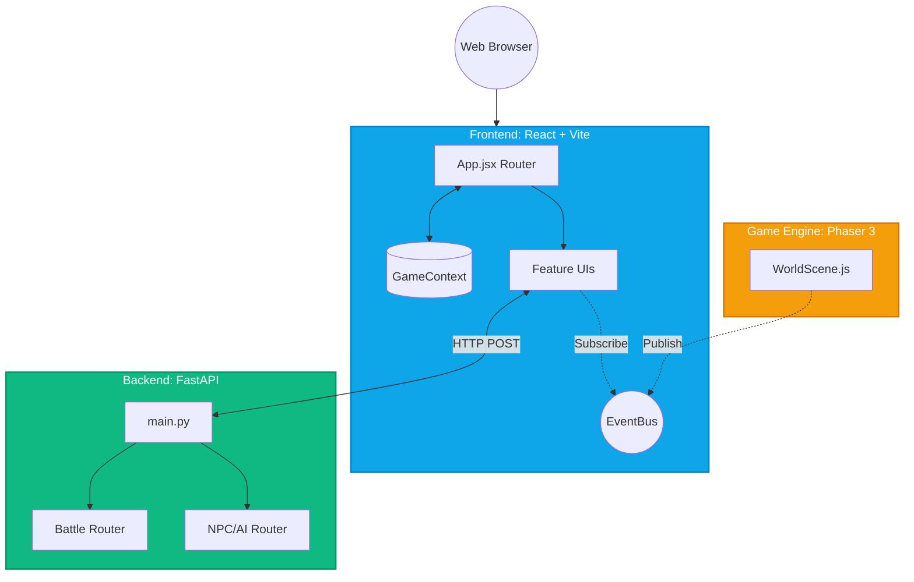
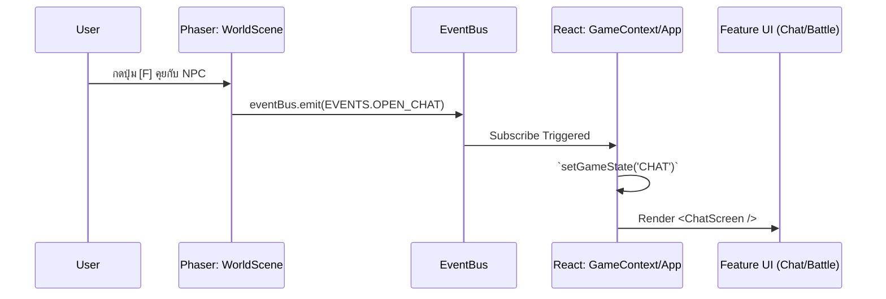

# 🌐 CHEMMA RPG: System Architecture (Feature-Based Modular)

```text
┌─────────────────────────────────────────────────────────────────────────────┐
│                           CHEMMA GAME SYSTEM                                │
└─────────────────────────────────────────────────────────────────────────────┘
                                      │
              ┌───────────────────────▼───────────────────────┐
              │           BROWSER (Client Side)               │
              │                                               │
              │  ┌─────────────────┐      ┌────────────────┐  │
              │  │ React UI (Vite) │◄────►│ Phaser 3 Game  │  │
              │  │  - MenuScreen   │  1   │  - WorldScene  │  │
              │  │  - BattleScreen │      │  - Map Tiles   │  │
              │  │  - ChatScreen   │      │  - Player/NPCs │  │
              │  └────────┬────────┘      └────────────────┘  │
              │           │                        ▲          │
              │           │ 2                      │ 3        │
              │           ▼                        │          │
              │  ┌─────────────────────────────────────────┐  │
              │  │          ระบบแกนกลาง (Core)            │  │
              │  │  - GameContext (ตัวแปร State)           │  │
              │  │  - EventBus (Pub/Sub รับส่ง Event)       │  │
              │  └─────────────────────────────────────────┘  │
              └───────────────────────┬───────────────────────┘
                                      │
                                      │ 4 (HTTP / REST API)
                                      ▼
              ┌───────────────────────────────────────────────┐
              │              BACKEND (Server Side)            │
              │                                               │
              │  ┌─────────────────────────────────────────┐  │
              │  │          FastAPI App (main.py)          │  │
              │  └────────┬───────────────────────┬────────┘  │
              │           │                       │           │
              │  ┌────────▼────────┐     ┌────────▼────────┐  │
              │  │ Features/Battle │     │  Features/NPC   │  │
              │  │  - router.py    │     │   - router.py   │  │
              │  │  - service.py   │     │   - service.py  │  │
              │  └─────────────────┘     └─────────────────┘  │
              │           │                       │           │
              │  ┌────────▼────────┐     ┌────────▼────────┐  │
              │  │    Database     │     │      LLM/AI     │  │
              │  │  (PostgreSQL)   │     │ (OpenRouter API)│  │
              │  └─────────────────┘     └─────────────────┘  │
              └───────────────────────────────────────────────┘

คำอธิบาย:
1. ผู้เล่นเดินชน NPC ในหน้าต่าง Phaser -> Phaser ประมวลผลและส่งสัญญาณออกไป
2. EventBus รับสัญญาณ (เช่น EVENTS.OPEN_CHAT) และอัปเดต GameContext
3. React รับรู้การเปลี่ยนแปลง State จึงวาด <ChatScreen /> ทับบนเกม
4. หน้าต่าง React ยิง API ไปหา Backend เพื่อเรียกปัญญาประดิษฐ์ (AI) 
```

เอกสารฉบับนี้อธิบายโครงสร้างสถาปัตยกรรมระบบของโปรเจกต์ **CHEMMA** ล่าสุดที่ได้รับการปรับปรุงเป็นรูปแบบ **Feature-based Modular Architecture** เพื่อให้รองรับการสเกลระบบขนาดใหญ่ (Scalability) ลดการผูกติดของโค้ด (Decoupling) และเตรียมพร้อมสำหรับการเพิ่มระบบใหม่ๆ เช่น AI และ Login Authentication ในอนาคต

---

## 1. High-Level Architecture (สถาปัตยกรรมระดับสูง)

ระบบแบ่งออกเป็น 2 ส่วนหลักคือ **Frontend (React + Phaser 3)** และ **Backend (FastAPI)** โดยทำงานแยกออกจากกันอย่างเด็ดขาดและสื่อสารกันผ่าน RESTful API



---

## 2. Frontend Architecture (React & Phaser Integration)

ความท้าทายหลักของระบบ Frontend คือการทำงานร่วมกันระหว่าง **React (Web UI)** และ **Phaser 3 (Game Canvas)** ซึ่งต่างฝ่ายต่างมี Lifecycle เป็นของตัวเอง 

เพื่อแก้ปัญหานี้ เราจึงใช้ระบบ **EventBus (Pub/Sub Pattern)** แทนการใช้ตัวแปรร่วมแบบ `window.*` 

### 2.1 Communication Flow (การสื่อสารข้ามระบบ)



### 2.2 โครงสร้างโฟลเดอร์ (Feature-based Directory)
โค้ดจะถูกจัดกลุ่มตามความสามารถ (Feature) ไม่ใช่ตามประเภทของไฟล์ (File Type) เพื่อให้ง่ายต่อการแก้ไข

```text
frontend/src/
├── core/               # ระบบแกนกลาง (EventBus.js, constants.js, GameContext.jsx)
├── data/               # ข้อมูลเกมคงที่แยกจาก Logic (mapLayout.js, elements.js, etc.)
├── features/           # โมดูลฟีเจอร์แยกส่วน (แก้ไขฟีเจอร์ไหน เข้าโฟลเดอร์นั้น)
│   ├── menu/           # หน้าแรกของเกม
│   ├── world/          # ตัวจัดการ Scene ของ Phaser (เกมหลัก)
│   ├── battle/         # UI ต่อสู้ และระบบคำนวณ (battleLogic.js)
│   └── chat/           # UI สำหรับคุยกับ Oracle (AI)
├── shared/             # Components ย่อยที่ใช้ซ้ำได้หลายที่ (ปุ่ม, โมดอล)
```

---

## 3. Backend Architecture (FastAPI)

Backend ถูกออกแบบให้เป็น **Stateless API** หมายความว่าตัวมันเองจะไม่จดจำสถานะของเกม แต่จะรอรับ Request, ทำการประมวลผลกฎ (Business Rules) และส่ง Response กลับไปเท่านั้น

### 3.1 Routing & Service Isolation
เหมือนกับ Frontend โครงสร้างถูกปรับเป็น Feature-based เพื่อให้โฟลเดอร์หนึ่งมีครบทั้ง `router.py` (รับ API) และ `service.py` (จัดการ Logic)

```mermaid
graph LR
    Req[HTTP Request] --> Main[app/main.py]
    
    subgraph Features [app/features/]
        Main --> Auth[auth/ <br> (Future Login)]
        Main --> Bat[battle/ <br> router & service]
        Main --> Npc[npc/ <br> router & service]
        Main --> AI[ai/ <br> (Future AI)]
    end
    
    Bat --> Res[HTTP Response]
    Npc --> Res
```

### 3.2 ฐานข้อมูลและโมเดล (Database & Shared Models)
ปัจจุบัน Pydantic Models สำหรับตรวจสอบข้อมูล (Validation) และ Schema จะถูกแชร์ร่วมกันในโฟลเดอร์ `backend/app/shared/models.py` และในอนาคตหากมีการต่อ Database ของจริงจะถูกรวมไว้ในโฟลเดอร์นี้เช่นกัน

---

## 4. Deployment Architecture (Docker)

ทั้งระบบถูกบรรจุไว้ใน Container อย่างสมบูรณ์ ทำให้สามารถรันโปรเจกต์ได้จบในคำสั่งเดียวผ่าน `docker-compose up`

- **Frontend Container**: ทำการ Build โค้ด React/Vite และเสิร์ฟไฟล์ Static ผ่าน `Nginx` (พอร์ต 80 หรือ 3000)
- **Backend Container**: รันโฟลเดอร์ Backend ผ่าน `Uvicorn` server สำหรับ FastAPI (พอร์ต 8000)

```mermaid
graph TD
    User((User Player)) --> |HTTP:80/3000| Nginx[Nginx Web Server <br> (Frontend Dist)]
    User --> |HTTP:8000/api| Uvicorn[Uvicorn Server <br> (FastAPI Backend)]
```

---

## 5. แผนการขยายระบบในอนาคต (Scalability Plan)
1. **Authentication System (ระบบล็อคอิน):** 
   - สามารถเขียน API ต่อที่ `backend/app/features/auth/`
   - ฝั่ง Frontend สร้าง `<LoginScreen />` ไว้ใน `features/auth/` และเพิ่ม State ลงใน `GameContext`
2. **AI System Migration (ระบบ AI ฉบับเต็ม):**
   - สามารถย้ายและอัปเกรดระบบคุยกับ NPC ทั้งหมดลงใน `features/ai/` ได้อย่างอิสระโดยไม่กระทบกับระบบต่อสู้ (Battle)
