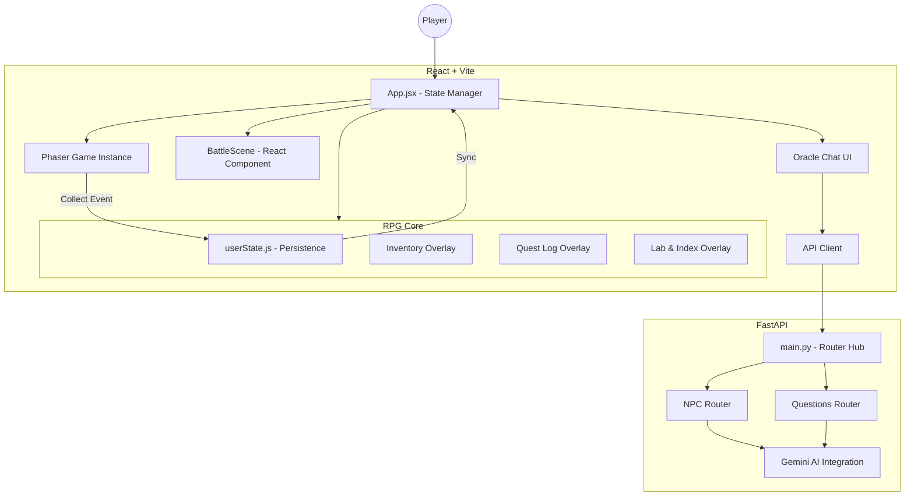

# CHEMMA System Architecture (Updated 2026-03-24)

This document outlines the modular architecture of the CHEMMA chemistry RPG, a hybrid web application combining high-performance game logic with a modern reactive UI.

## Tech Stack Overview

- **Frontend**: [Vite](https://vitejs.dev/) + [React](https://reactjs.org/) + [Phaser 3](https://phaser.io/) + [Tailwind CSS](https://tailwindcss.com/)
- **Backend**: [FastAPI](https://fastapi.tiangolo.com/) (Python) + [Gemini API](https://ai.google.dev/)
- **Infrastructure**: [Docker](https://www.docker.com/) & [Docker Compose](https://docs.docker.com/compose/)
- **Mapping**: [Tiled Map Editor](https://www.mapeditor.org/)

## System Components

### Detailed Component Roles

#### 1. Frontend (Web Client)
- **`App.jsx`**: The core React component that manages global game states (`MENU`, `GAME`, `BATTLE`). It overlays UI elements (HUD, Chat, Battle, RPG Overlays) on top of the Phaser canvas.
- **`core/userState.js`**: Handles **State Persistence**. It saves/loads player progress (Level, XP, Inventory, Quests) to `localStorage`.
- **`game/phaserGame.js`**: Initializes the Phaser 3 engine.
- **`scenes/WorldScene.js`**: Handles the main exploration logic, player movement, and collision detection for items and NPCs.
- **`components/battle/BattleScene.js`**: A specialized React component for the chemistry-based turn-based combat system.
- **`api/client.js`**: Handles asynchronous communication with the backend.

#### 2. Backend (API Server)
- **`app/main.py`**: Entry point that configures CORS and includes functional routers.
- **`app/routes/npc.py`**: Manages NPC dialogues and personas using LLM (Gemini).
- **`app/routes/questions.py`**: Handles chemistry knowledge queries.
- **`app/services/`**: Contains the logic for interacting with external AI services.

## Core RPG Workflows

### 1. Quest & Leveling Flow
- **Quest Tracking**: Quests are stored in the state. Dialogue with NPCs can update quest status.
- **XP Progression**: XP is gained from collecting items (`WorldScene.js`) or winning battles. `userState.js` calculates level-ups and next-level requirements.

### 2. Element Collection & Inventory
- **Collecting**: Overlaps in `WorldScene.js` trigger `window.addItem()`.
- **Inventory**: Players can open the "Bag" overlay anytime to view their chemical stash.

### 3. Lab Mixing & Index
- **Lab System**: A dedicated overlay allows players to select discovered elements from their inventory and mix them into compounds, unlocking new entries in the **Chemistry Index**.

## Data Flows

### Exploration & Interaction
1. Player moves in `WorldScene.js`.
2. Collision with a collectible triggers `addItem()`.
3. `App.jsx` updates `userData` state, which is then persisted to `localStorage`.

### AI Chat & Dialogue
1. NPCs trigger `window.openChat()`.
2. User queries are sent via `APIClient` to the FastAPI backend.
3. Backend calls Gemini AI to provide context-aware chemical assistance.

## Deployment Profile
Managed via `docker-compose.yml`:
- **Frontend**: Nginx serving static files.
- **Backend**: Uvicorn running the FastAPI app.
